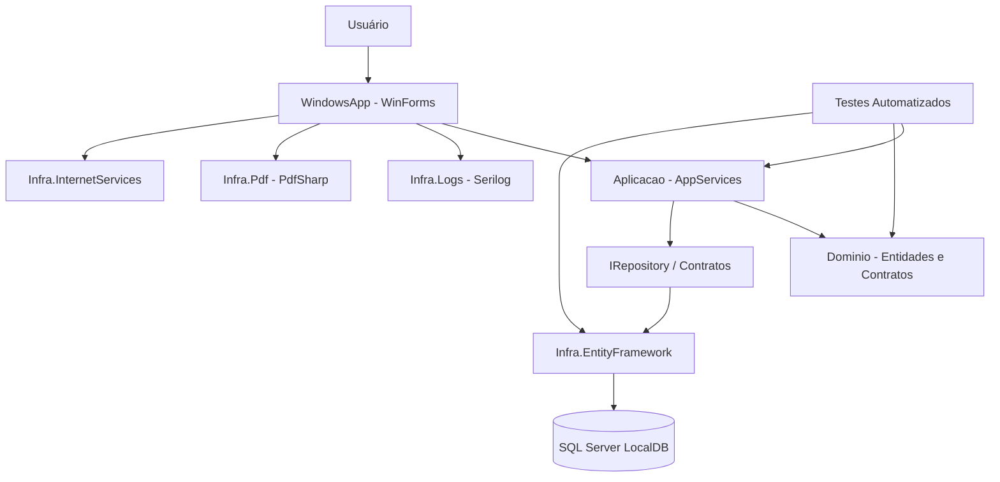

# Arquitetura do Sistema - Car Rental App

## Identificação

- Disciplina: CSI410 - Engenharia de Software II
- Projeto analisado: Matrix-Developers/Car-Rental-App
- Integrantes:
  - Luccas Vinicius - GitHub: `luccas00`
  - Davi Zanoti - GitHub: `DaviZ2399`

## Visão geral

O projeto **Car Rental App** é uma aplicação desktop desenvolvida em C# com Windows Forms. O sistema permite gerenciar uma locadora de veículos, incluindo cadastros de funcionários, clientes, serviços, cupons, parceiros, grupos de veículos, veículos, locações e devoluções.

A arquitetura do projeto é organizada em camadas, com separação clara entre apresentação, aplicação, domínio, infraestrutura e testes. Essa estrutura reduz o acoplamento entre as partes do sistema e facilita manutenção, evolução e testes automatizados.

## Camadas identificadas

### 1. Camada de apresentação

Projeto:

```text
LocadoraDeVeiculos.WindowsApp
```

Responsável pela interface gráfica do sistema, implementada com Windows Forms. Essa camada contém telas, formulários, menus e operações acionadas pelo usuário.

Exemplos:

```text
Features/Login/TelaLogin.cs
TelaPrincipalForm.cs
Features/Clientes
Features/Veiculos
Features/Locacoes
Features/Devolucoes
```

### 2. Camada de aplicação

Projeto:

```text
LocadoraDeVeiculos.Aplicacao
```

Responsável por coordenar os casos de uso do sistema. Essa camada utiliza entidades e contratos do domínio e chama os repositórios para executar operações como inserir, editar, excluir e selecionar registros.

Exemplos:

```text
ClienteAppService
FuncionarioAppService
LocacaoAppService
VeiculoAppService
```

### 3. Camada de domínio

Projeto:

```text
LocadoraDeVeiculos.Dominio
```

Contém as entidades principais e contratos compartilhados do sistema. Representa as regras centrais do negócio de locação de veículos.

Exemplos:

```text
Cliente
Funcionario
Veiculo
Locacao
Cupom
Servico
IRepository<T>
```

### 4. Camada de infraestrutura

Projetos:

```text
LocadoraDeVeiculos.Infra.EntityFramework
LocadoraDeVeiculos.Infra.SQL
LocadoraDeVeiculos.Infra.Pdf
LocadoraDeVeiculos.Infra.Logs
LocadoraDeVeiculos.Infra.InternetServices
```

Responsável por detalhes técnicos externos ao domínio, como persistência com Entity Framework, banco de dados SQL, geração de PDF, geração de logs e serviços auxiliares.

### 5. Camada de testes

Projetos:

```text
LocadoraDeVeiculos.UnitTests
LocadoraDeVeiculos.ApplicationTests
LocadoraDeVeiculos.ORMTests
LocadoraDeVeiculos.TestDataBuilders
```

A solução já possui uma base relevante de testes, incluindo testes unitários, testes de aplicação, testes de ORM e builders para criação de dados de teste.

## Justificativa arquitetural

A arquitetura identificada se aproxima de uma arquitetura em camadas, com características de Clean Architecture. A interface gráfica depende da camada de aplicação, a aplicação depende do domínio e a infraestrutura implementa detalhes técnicos como persistência e logs.

Essa organização é adequada para o sistema porque:

- separa regras de negócio da interface gráfica;
- facilita manutenção e evolução;
- permite testar regras e serviços sem depender diretamente da UI;
- centraliza detalhes técnicos na camada de infraestrutura;
- permite uso de injeção de dependência para reduzir acoplamento.

## Diagrama de componentes



## Observação técnica

Durante a análise foi identificado que o projeto já utiliza Autofac para injeção de dependência em diversos pontos da aplicação. Porém, a tela de login ainda criava manualmente serviços e repositórios, o que gerava acoplamento entre a interface e a infraestrutura. Esse ponto foi selecionado para refatoração na issue #216.
